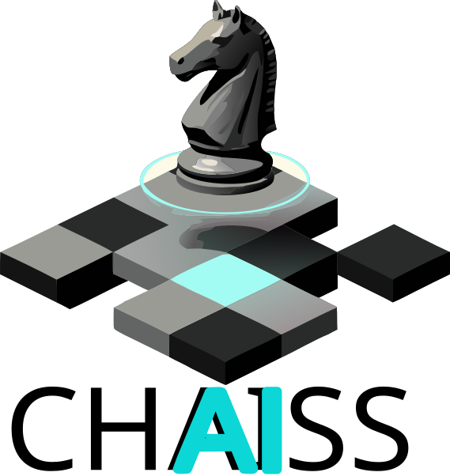

<p align="center">
  
</p>


# Chaiss

**Chaiss** is an intelligent, AI-assisted chessboard application built from the ground up in Rust using the modern `egui` immediate mode UI framework. Designed both for learning and deep exploration of chess, Chaiss integrates tightly with frontier Large Language Models (LLMs) to provide real-time guidance, context-aware analysis, and an environment to experiment with different lines.

## Motivation

This project was born out of two distinct drivers:
1. **The Vibe Coding Experiment:** A desire to experiment working in a "vibe coding" fashion, efficiently juggling multiple projects at once.
2. **The Chess Match Reality Check:** I found myself spending far too much time consulting Gemini for my next best move against my niece's boyfriend, only to realize that LLMs (both Gemini, and ChatGPT even more so) suffered from terrible inherent board vision and memory limitations.

Within mere hours of spelling out that I wanted to use my favorite language, my favorite UI framework within that language, and my favorite crate for interacting with LLMs, I had a working prototype. Chaiss significantly improved my moves simply by being able to persistently and accurately present the true current board state to the LLM backend!

## Key Features

- **Heat Map Targeting:** A unique visualization that highlights the targeted ranges of chess pieces. Overlapping attacks increase the intensity of the square's color while remaining distinctly distinguishable from the underlying light/dark squares.
- **LLM Integration:** Talk and analyze games with advanced AI models (like Gemini and ChatGPT) directly in the app. Utilizing the `llm` crate, interactions are configurable and context-aware.
- **Game & Player Persistence:** Name your players and your games. Relying on SQLite and `sqlx`, Chaiss allows you to save, load, and manage a library of your past chess explorations easily.
- **Dual Control Schemes:** Seamlessly move pieces via Mouse/Touch, or use intuitive keyboard-based algebraic notation highlighting.
- **Exploration Mode:** A sandboxed mode offering robust undo/redo capabilities to test "what if" scenarios before instantly reverting to the live game state.

## Project Structure

- `core/` - Rust source code for backend logic, database integrations (`sqlx`), and models.
- `desktop/` - Rust source code for the `egui`-based frontend application. Includes UI components and an `assets/` directory.
- `docs/` - Requirements, design documents, and developer journals.
- `tools/` - Helper scripts, including the SQLite database initialization script.

## Getting Started

1. **Clone the repository:**
   ```bash
   git clone <repository-url>
   cd chaiss
   ```
2. **Database Setup:**
   Initialize the local SQLite database by running the setup script (this will create `chaiss.db` and the required schemas):
   ```bash
   ./tools/scripts/init_db.sh
   ```
3. **Environment Configuration:**
   Copy the provided `.env.example` to `.env` and fill in your desired backend, model, and API keys.
   ```bash
   cp .env.example .env
   ```
4. **Run Locally:**
   Thanks to the pre-processed `sqlx` cache, the application can be built purely offline. Just run:
   ```bash
   cargo run --release
   ```

## Development and Contributions

For a detailed breakdown of the features, architectural choices, and upcoming roadmap, please refer to the `docs/requirements/chaiss_requirements.md` file.

## Acknowledgments

- A huge shout-out and thank you to **Emil Ernerfeldt** (@emilk) and contributors for creating the incredible [`egui`](https://github.com/emilk/egui) framework. Its direct rendering approach enabled rapid prototyping that made this feasible as a weekend project, bringing the joy back to UI development!
- Special thanks to **graniet** (@graniet) for the [`llm`](https://github.com/graniet/llm) crate, providing the unified API layer that brilliantly connects Chaiss to frontier models line Gemini, OpenAI, and Anthropic.
