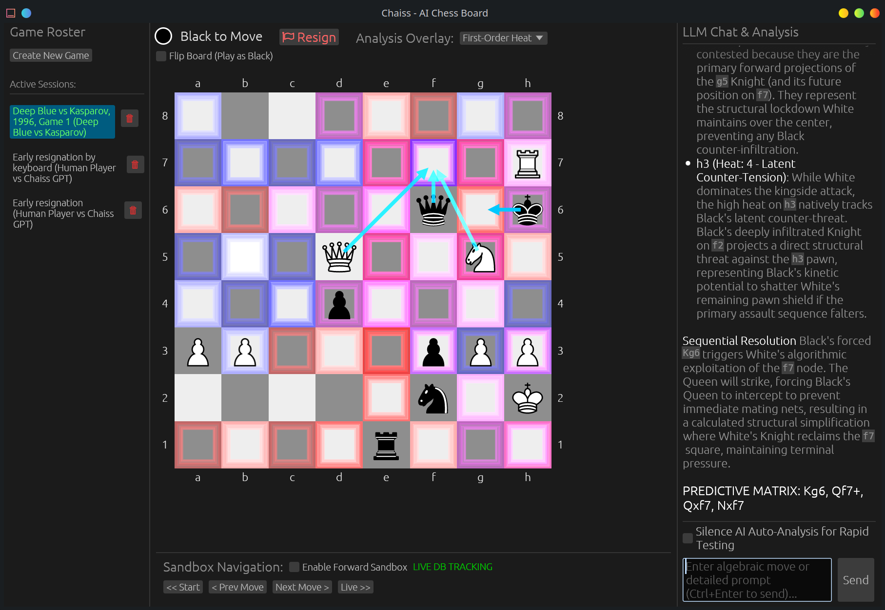

# Chaiss User Guide

Welcome to the **Chaiss** documentation. This guide covers everything you need to know to get started with the application, navigate the interface, and securely explore chess using AI analysis.

## Creating a Game

1. On the left **Session Roster Panel**, click the **"+ New Match"** button.
2. A configuration popup will gracefully appear asking you to label the specific Game Name and nominate both the White and Black player identities. 
3. Click "Start Game". Your new empty session is now fundamentally bound structurally to SQLite and ready for moves! You can safely quit anytime relying on the automatic background saving mechanisms.

## Loading a Game from a PGN

Chaiss has rigorous textual parsing capabilities organically tracking complex Algebraic geometry natively inside its LLM-stream boundaries. 

1. Create a **New Match** or open an active session.
2. Simply copy raw PGN text from any external viewer or chess database.
3. **Paste the raw PGN directly** into the Chat Box on the right side window.
4. Press Enter (or `Ctrl+Enter`). 
5. Chaiss will instantly physically translate the entire PGN string over the structural Egui rendering module to recreate the board instantly!

## Making Moves (Dual Controls)

Chaiss embraces dual control structures directly so you can experiment efficiently using the method that matches your immediate workflow seamlessly.

### Using the Mouse
- **Click to Move**: Simply tap directly on any of your pieces physically located on the geometric Egui board. The built-in legal-move generator will calculate exact bounding rules and color all valid structural destinations green. 
- Click on any of the green destination dots to permanently execute the move.

### Using Keyboard Input (Algebraic Notation)
- If you prefer typing out sequences dynamically, interact entirely with the **LLM Chat Input** box.
- Type any single formal chess notation command organically into the box (e.g., `e4`, `Nf3`, `O-O`, `Bxf7+`). 
- Simply hit `Ctrl+Enter` to seamlessly push the move across the board's internal matrix. The engine parses the exact translation locally before initiating an AI Contextual sync over the move!

## Advanced Interrogations & AI Chats

The LLM is always analyzing your explicit actions! But you can proactively chat with the LLM anytime:
- Simply type conceptual questions directly into the chat box ("What are my main weaknesses?", "Should I sacrifice the Bishop?").
- The system naturally injects an absolute geometric breakdown of the Board and Heatmap to your requested frontier-model on the fly safely without further configurations on your part!
